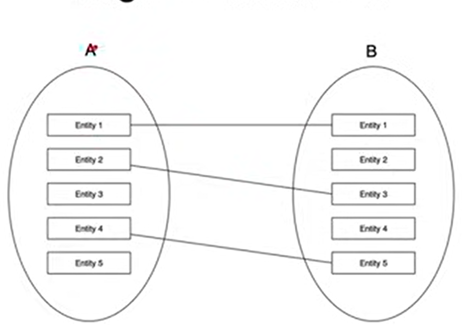
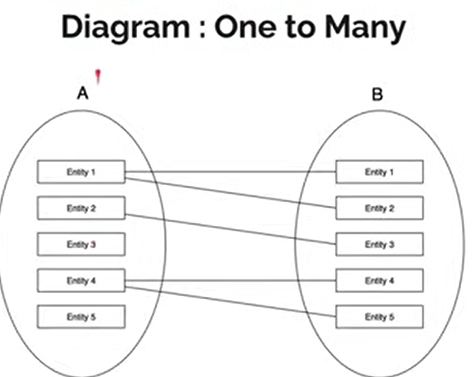
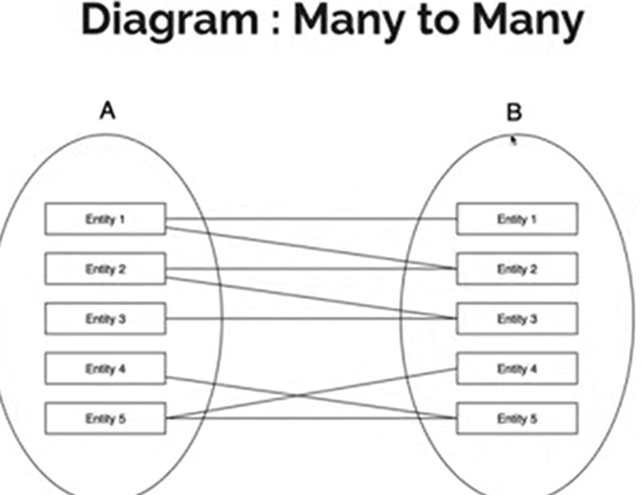

# Daily Learning Log 18/02/2025

## Today's Focus

- Pemahaman Entity Relationship.
- Tahap-tahap penggunaan Entity Relationship Diagram untuk membuat awal sebuah website.
- Perkenalan tipe data.
- Implementasi model data.
- Kardinalitas atau Derajat Relasi.

## What I Learned

### 1. Entity Relationship.

1. **Entity.**

- Entity merupakan individu yang mewakili data (faktal yang nyata, dan bisa dibedakan dari sesuatu yang lain)
- Saat menentukan sebuah Entity, kita perlu lihat ruang lingkup yang sedang kita kerjakan
  1. Attribut.
Setiap Entity pasti memiliki Attribute yang mendeskripsikan karakteristik dari Entity tersebu Penentuan Attribute dalam Entity biasanya berdasarkan fakta yang ada dan yang dibutuhkan dalam ruang lingkup nya saja.

2. **Relationship.**

Relationship dalam database atau basis data adalah hubungan antara dua atau lebih tabel berdasarkan kolom tertentu yang saling terhubung. Biasanya, hubungan ini dibentuk menggunakan Primary Key (PK) dan Foreign Key (FK) untuk menjaga integritas data.

### 2. Tipe data.

- Text, untuk kolom yang berisikan data karakter, misal Nama, Alamat, dan sejenisnya Number, untuk kolom yang berisikan data angka, misal Harga, Stok, dan sejenisnya.
- Date, Time, Timestamp untuk kolom yang berisikan data tanggal, waktu atau gabungan tanggal dan waktu, misalnya Tanggal Lahir, Waktu Pendaftaran, dan sejenisnya.
- Boolean, untuk kolom yang berisikan data benar (true) atau salah (false), misal Status Menikah, dan sejenisnya.
  Dan masih banyak tipe data lainnya
- Untuk detail tipe data tidak akan dibahas di materi ini, karena sudah sangat spesifik ke aplikasi sistem basis yang kita gunakan.

### 3. Implementasi Model data.

- Implementasi model data merupakan tahapan untuk membuat basis data secara fisik yang ditempatkan dalam disk dengan bantuan sistem basis data.
- Setelah selesai membuat ERD, kita bisa mulai membuat implementasi nya dalam basis data.

### 4 Kardinalitas atau Derajat Relasi.

- Kardinalitas relasi menunjukkan tentang jumlah Entity yang dapat berelasi dengan Entity lainnya
- Contoh misal pada kasus Toko Online. Entity Penjual bisa berelasi atau menjual dengan satu Entity Barang, atau lebih, atau bahkan tidak ada.

  1. **One to one (satu ke satu).**

  - One to One artinya hubungan antara Entity A misalnya, hanya bisa berhubungan dengan Entit B dengan maksimal hanya satu Entity saja.
  - Begitu pula sebaliknya, Entity B hanya bisa berelasi dengan satu Entity A.
  

  2. **One to many (satu ke banyak)**

  - One to Many artinya hubungan antara Entity A misalnya, bisa berhubungan dengan banyak Entity B.
  - Tetapi tidak sebaliknya. Entity 8 hanya bisa berelasi dengan satu Entity A.
  - Si a memiliki 2 cabang dan b hanya 1,

  3. **Many to One (Banyak ke Satu)**

  - Many to One artinya hubungan antara Entity A misalnya, hanya bisa berhubungan dengan satu Entity B.
  - Tetapi tidak sebaliknya, Entity B bisa berelasi ke banyak Entity A.
  - note hayan kebalikan dari one to many jadu di b sekarang memiliki dua cabang dan si a memiliki 1 cabang.

  4. **Many to Many (Banyak ke Banyak)**

  - Many to Many artinya hubungan antara Entity A misalnya, bisa berhubungan dengan banyak Entity B.
  - Begitu juga sebaliknya, Entity B bisa berelasi ke banyak Entity A juga.

## Resources Used 📚

- [Belajar basis data untuk pemula](https://youtu.be/S4igMZFCvh8?si=Qds5Y0-nIs9h83A1)
