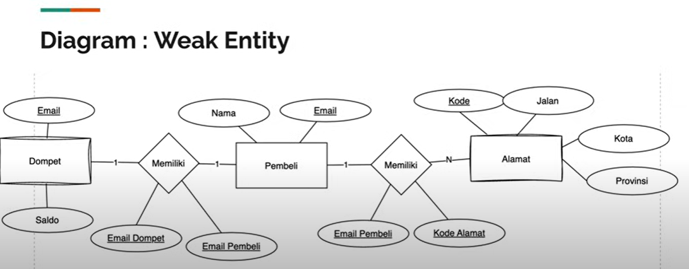
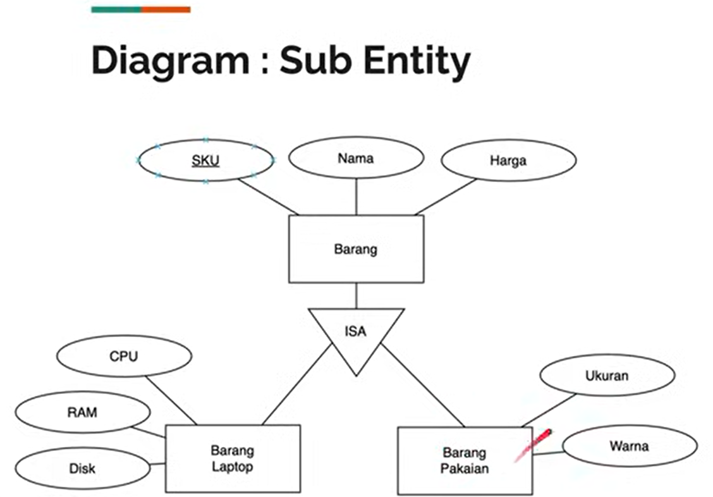
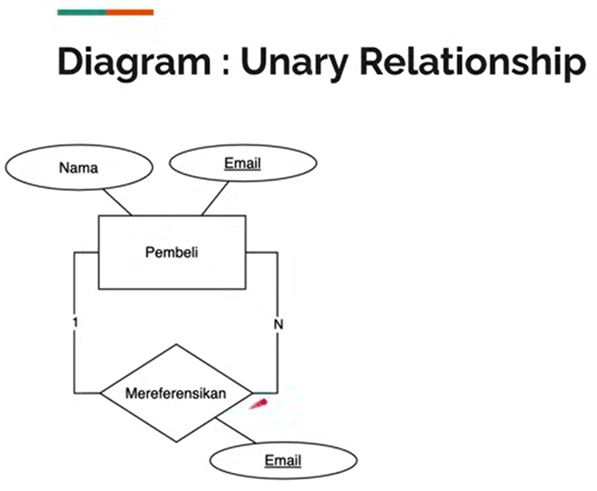
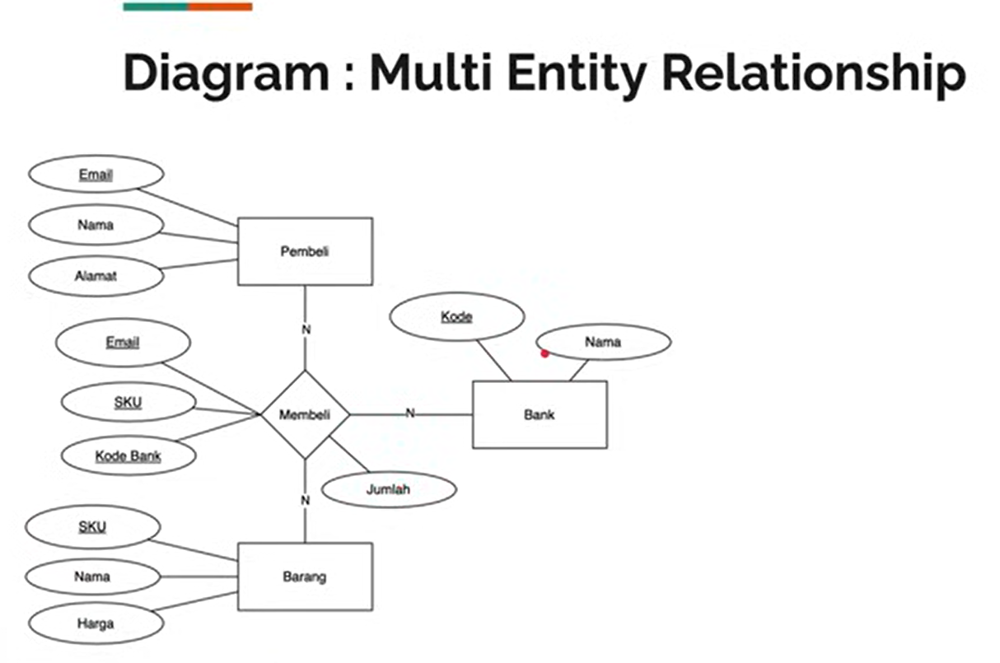
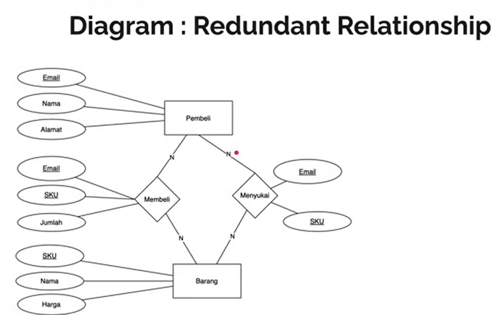

# Daily Learning Log 19/02/2025

## Today's Focus

- Implementaasi model data yang relational.
- Model data lain nya.
- Normalisasi Data.

## What I Learned

### 1. Implementasi.

Menerapkan model hubungan antar tabel menggunakan Foreign Key untuk menjaga integritas data.

### 2. Model data Lainya.

- Sebenarnya sampai materi Model Data Relational, kita sudah mulai bisa membuat basis data yang baik.
- Namun, pada kasus-kasus tertentu, kadang ada jenis model data lainnya. 

    1. **Weak Entity.** 
    - Entitas lemah sebenarnya adalah entitas biasa, namun sifatnya lemah, artinya dia tidak bisa berdisi sendiri. 
    - Weak entity biasanya berelasi dengan entity utama. 
    - Contoh pada kasus sebelumnya Dompet bisa dibilang weak entity, karena tidak bisa berdiri sendiri tanpa adanya Pembeli. 
    - Atau, kita bisa pisahkan alamat menjadi entitas lemah, yang hanya bisa ada jika terdapat entitas Pembeli.
  

    2. **Sub Entity.**
      - Saat membuat entity, bisa terjadi adanya beberapa entity yang lebih detail, yang memiliki kesamaan attribut, namun terdapat juga perbedaan nya.
      - Corttoh, pada kanan Entity Barang kemungkinan akan ada banyak jenis barang, dan tiap jenis barang bisa berbeda atribut yang dimilikinya.
      - Misal saja kita tambahkan Entity Barang Laptop dan Barang Pakaian, kedua entity tersebut memiliki kesamaan, namun memiliki perbedaan juga.
      - Untuk menggambarkan Sub Entity kita akan menggunakan diagram ISA.

  

    3. **Unary Relationship.**
      - Unary Relationship adalah relasi yang terjadi pada entitas dengan entitas dirinya sendiri.
      - Hal ini sering sekali terjadi.
      - Misal, pada kasus Toko Online, misal kita akan menambah fitur Referal (Member get Member), dan kita akan membolehkan Pembeli merekomendasikan Pembeli lain untuk mendapat bonus berupa salido tertentu misalnya.
      - Pada kasus ini, berarti kita harus membuat Unary Relationship dari Pembeli ke Pembeli lagi.
      - note!!Referensi adalah rujukan atau acuan yang digunakan untuk menghubungkan suatu informasi dengan sumber lain. Dalam berbagai konteks.

  

    4. **Multi Entity Relationship.**
      - Relasi multi entitas merupakan relasi yang terjadi terhadap lebih dari dua entitas Pada kasus sebelumnya contohnya Pembeli memiliki relasi membeli 	 dengan Barang.
      - Misal kita akan tambahkan Bank dengan relasi Pembeli membeli Barang, menggunakan Bank.
         
    5. **Redundant Relationship.** 
    - Relasi antar entitas boleh lebih dari satu, jika ada disa entitas memiliki relasi lebih dari satu antar entitas tersebut, artinya itu adalah relasi ganda. 
    - Banyak kasus seperti ini, contohnya pada kasus relasi Pembeli dan Barang, misal kita tambahkan rellasi Pembeli menyukal Barang. 
    - Artinya tidak hanya Membeli, tapi juga Menyukai.
    

### 3. Normalisasi.

- Normalisasi data adalah proses atau tahapan dalam membuat basis data, yang bertujuan untuk menghilangkan data redundancy/ganda dan data yang tidak konsisten.
- Aturan dalam normalisasi data adalah membagi tabel besar menjadi tabel yang lebih kecil, dan menghubungkan menggunakan relasi.

## Resources Used 📚

- [Belajar basis data untuk pemula](https://youtu.be/S4igMZFCvh8?si=Qds5Y0-nIs9h83A1)
