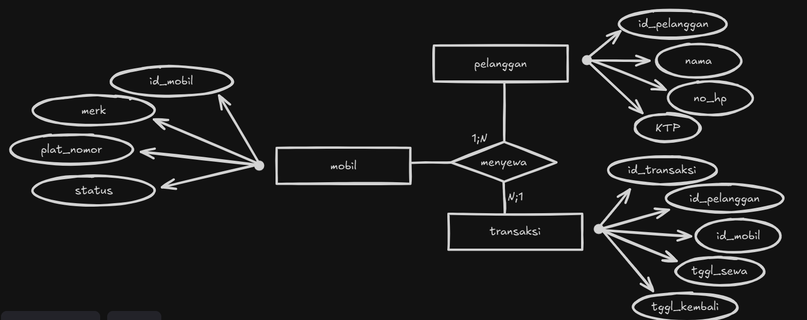

# Database Rental mobil  25-04-2025

## Jawaban soal study kasus :

1.**buat database dengan nama rental mobil :** 
    - CREATE DATABASE rental_mobil;

2. **buat table :**
    - create table mobil (
        id_mobil varchar(10) primary key,
        merek varchar(50),
        plat_nomor varchar(20) unique,
        status varchar(20)
    );

    - create table pelanggan (
        id_pelanggan varchar(10) primary key,
        nama varchar(100),
        no_ktp varchar(20) unique,
        no_telepon varchar(15)
    );

    - create table transaksi (
        id_transaksi varchar(10) primary key,
        id_pelanggan varchar(10),
        id_mobil varchar(10),
        tanggal_sewa date,
        tanggal_kembali date,
        status_transaksi varchar(20),
        foreign key (id_pelanggan) references pelanggan(id_pelanggan),
        foreign key (id_mobil) references mobil(id_mobil)
    );

3. **buat relasi antar table :**
    - foreign key (id_pelanggan) references pelanggan(id_pelanggan),
    - foreign key (id_mobil) references mobil(id_mobil)

4. **Tampilkan nama pelanggan, merk mobil, dan tanggal sewa menggunakan JOIN :**
    - SELECT 
    nama AS nama_pelanggan,
    merk AS merek_mobil,
    tanggal_sewa
    FROM 
      transaksi
    JOIN 
        pelanggan ON transaksi.id_pelanggan = pelanggan.id_pelanggan
    JOIN 
        mobil ON transaksi.id_mobil = mobil.id_mobil;

5. **Tampilkan semua mobil yang status-nya 'tersedia' :**
    - SELECT * FROM mobil
      WHERE status = 'tersedia';

6. **Update status mobil dengan id = 1 menjadi 'sewa' :**
    - UPDATE mobil
      SET status = 'sewa'  
      WHERE id_mobil = 'M001';

7. **Hapus transaksi sewa dengan id = 1 :**
    - DELETE FROM transaksi
      WHERE id_transaksi = 'T001';

8. **Hitung jumlah mobil yang sedang disewa menggunakan fungsi agregat:**
    - SELECT COUNT(*) AS jumlah_mobil_disewa
      FROM mobil
      WHERE status = 'sewa';

9. **Insert data :**
    - INSERT INTO mobil (id_mobil, merk, plat_nomor, status) values 
      ('M001', 'Innova Venturer', 'D1111SEL', 'tersedia'),
      ('M002', 'BMW F30', 'B3333CEK', 'tersedia');

    - INSERT INTO pelanggan (id_pelanggan, nama, no_ktp, no_telepon) values 
      ('P001', 'Kazama', '1234567890123456', '08123456789'),
      ('P002', 'Pablo', '6543210987654321', '08234567890');

    - INSERT INTO transaksi (id_transaksi, id_pelanggan, id_mobil, tanggal_sewa, tanggal_kembali   status_transaksi) values 
    ('T001', 'P001', 'M001', '2025-04-20', '2025-04-23', 'sewa');

## ERD rental Mobil

